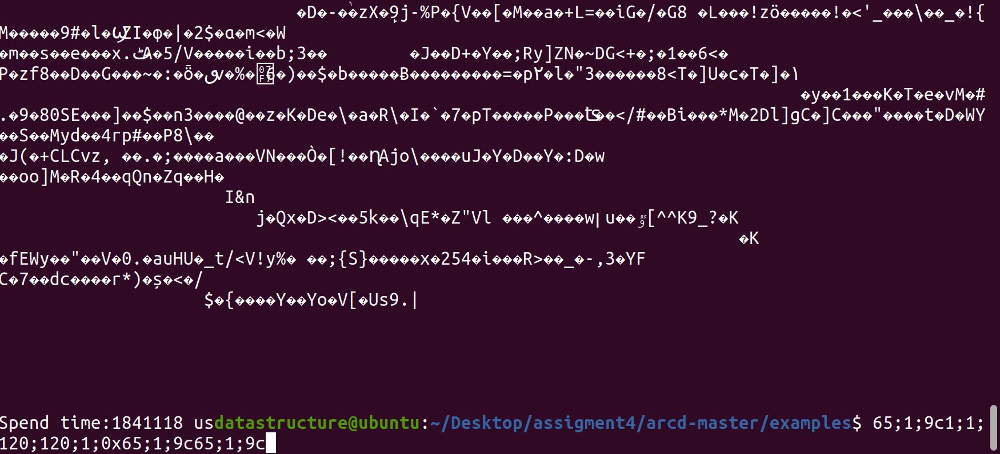
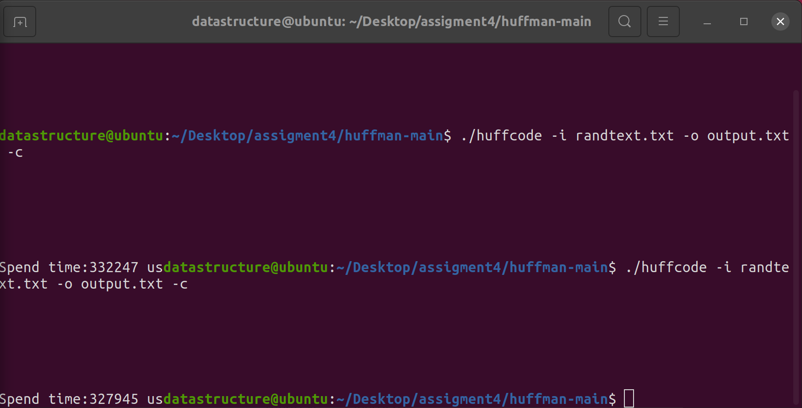

# **ASSIGNMENT_3**
### **result of Arithemtic Coding**

### **Huffman Coding**

## **build**
### **Arithemtic Coding:**

```../arcd-master$ cmake```

```../arcd-master/examples$ make```

Run:
```/arcd-master/examples$ ./arcd_stream -e <"./randtext.txt"|tee output.txt```

### **Huffman Coding:**

```make```

Run:```/huffman-main$ ./huffcode -i randtext.txt -o output.txt -c```